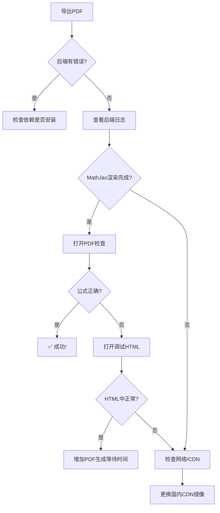

# 📄 PDF导出公式渲染修复指南

## 🔧 已完成的修复

### 优化内容

1. **增加渲染等待时间**
   - 从10秒增加到30秒
   - 添加重试机制和备用检测

2. **改进MathJax配置**
   - 使用同步加载（去掉async）
   - 添加错误捕获
   - 优化启动配置

3. **添加调试功能**
   - 自动保存调试HTML
   - 详细的渲染日志
   - 便于排查问题

---

## 🚀 测试步骤

### 第1步：重启后端服务

**必须重启才能应用修复！**

1. **停止当前后端**（按 Ctrl+C）

2. **重新启动后端**：
   ```bash
   双击：【点我启动】后端服务-使用虚拟环境.bat
   ```

3. **确认启动成功**：
   ```
   看到：INFO: Uvicorn running on http://127.0.0.1:8000
   ```

---

### 第2步：导出PDF测试

1. **刷新前端页面**（F5）

2. **进入"生成的题目"标签页**

3. **选择包含公式的题目**

4. **点击"📥 导出选中"**

5. **等待生成**（现在会更久，约15-45秒）

---

### 第3步：检查后端日志

在后端控制台中查看详细日志：

```
[PDF导出] 步骤1: 构建HTML文档...
[PDF导出] ✓ HTML文档构建完成
[PDF导出] ✓ HTML文件保存至: ...
[PDF导出] 📝 调试HTML已保存至: backend/generated_papers/latest_export_debug.html
[PDF导出] 💡 提示：可在浏览器中打开此文件检查公式渲染
[PDF导出] 步骤3: 启动无头浏览器...
[PDF导出] ✓ 浏览器启动成功
[PDF导出] 步骤4: 加载HTML并执行MathJax渲染...
[PDF导出] 等待MathJax渲染...
[PDF导出] ✓ MathJax渲染完成（通过标记检测）  ← 关键！
[PDF导出] 步骤5: 生成PDF文件...
[PDF导出] ✓ PDF生成成功
[PDF导出] ✅ 导出完成
```

**关键日志：**
- ✅ `MathJax渲染完成` - 表示成功
- ⚠️ `MathJax渲染超时` - 可能有问题

---

### 第4步：使用调试HTML验证

**这是最重要的一步！**

1. **找到调试HTML文件**：
   ```
   backend/generated_papers/latest_export_debug.html
   ```

2. **用浏览器打开**（右键 -> 打开方式 -> Chrome/Edge）

3. **检查公式是否正确渲染**：
   - ✅ 看到美观的数学公式 → MathJax工作正常
   - ❌ 还是看到 `$...$` 源码 → MathJax加载失败

4. **打开浏览器控制台**（F12）：
   - 查看是否有错误信息
   - 查看是否有 "✅ MathJax渲染完成" 日志

---

## 🐛 如果仍然失败

### 情况1：调试HTML中公式也未渲染

**原因：MathJax CDN加载失败（网络问题）**

**解决方案A：使用国内CDN镜像**

修改 `backend/main_simple.py`，将MathJax CDN改为：

```python
# 原来的（国外CDN）：
<script src="https://cdn.jsdelivr.net/npm/mathjax@3/es5/tex-svg.js"></script>

# 改为（国内镜像）：
<script src="https://cdn.staticfile.org/mathjax/3.2.2/es5/tex-svg.js"></script>

# 或使用（备用镜像）：
<script src="https://cdnjs.cloudflare.com/ajax/libs/mathjax/3.2.2/es5/tex-svg.min.js"></script>
```

**解决方案B：下载MathJax本地使用**

如果网络实在不行，可以下载MathJax到本地。

---

### 情况2：调试HTML正常，但PDF中不正常

**原因：Pyppeteer渲染时间不够**

**解决方案：增加额外等待时间**

在 `backend/main_simple.py` 的PDF生成前添加：

```python
# 在生成PDF之前，额外等待
await asyncio.sleep(10)  # 额外等待10秒
```

---

### 情况3：特定公式不渲染

**原因：LaTeX语法错误**

**检查方法：**
1. 查看后端日志中的题目内容
2. 确认LaTeX语法正确
3. 常见错误：
   - 缺少转义：`\frac` 要写成 `\\frac`
   - 括号不匹配
   - 特殊字符未转义

---

## 📊 性能说明

### 导出时间

| 题目数量 | 包含公式 | 预计时间 |
|----------|----------|----------|
| 1-3题 | 少量 | 15-30秒 |
| 1-3题 | 大量 | 30-45秒 |
| 5-10题 | 少量 | 30-60秒 |
| 5-10题 | 大量 | 60-90秒 |

**注意：**
- 首次导出会更慢（Chromium初始化）
- 后续导出会快很多
- 网络不好时会更慢（加载MathJax CDN）

---

## 🎯 快速诊断流程



---

## ✅ 验收标准

导出成功的标志：

1. ✅ 后端日志显示 "MathJax渲染完成"
2. ✅ 调试HTML在浏览器中公式正确显示
3. ✅ PDF文件中公式清晰、美观
4. ✅ 没有 `$...$` 源码显示

---

## 💡 最佳实践

### 减少导出失败的建议

1. **保持网络畅通**
   - MathJax需要从CDN加载（首次）
   - 建议在网络良好时测试

2. **控制题目数量**
   - 单次导出不超过10道题
   - 减少公式密集的题目

3. **定期测试**
   - 生成新题目后及时测试导出
   - 发现问题及早解决

4. **保存调试HTML**
   - 每次导出都会保存
   - 可以对比前后差异

---

## 📞 获取帮助

如果按照以上步骤仍然无法解决，请提供：

1. 后端完整日志（PDF导出部分）
2. 调试HTML文件内容（前100行）
3. 浏览器控制台错误信息
4. 网络环境说明（是否能访问国外CDN）

---

**版本：** V25.0.1  
**更新时间：** 2024-10-25  
**状态：** 已优化

祝使用顺利！📚✨

