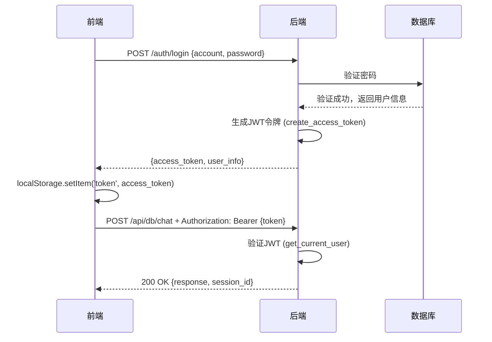

# 🔧 登录过期问题 - 紧急修复完成

## 📋 问题描述

用户反馈：登录后总是弹出"登录已过期，请重新登录"的提示。

**后端日志显示：**
```
✅ 用户登录成功: demo_user
POST /auth/login HTTP/1.1" 200 OK
GET /api/db/sessions?mode=review HTTP/1.1" 401 Unauthorized  ❌
POST /api/db/chat HTTP/1.1" 401 Unauthorized  ❌
```

登录成功返回200，但后续所有API请求都返回401未授权。

---

## 🔍 问题根因

**前后端数据格式不匹配！**

### 后端返回格式（`auth_api.py`）

```python
class LoginResponse(BaseModel):
    access_token: str        # ✅ 实际字段名
    token_type: str
    user_info: dict          # ✅ 包含 user_id, account
```

登录成功返回：
```json
{
  "access_token": "eyJhbGciOiJIUzI1NiIsInR5cCI6IkpXVCJ9...",
  "token_type": "bearer",
  "user_info": {
    "user_id": "48fd341f-5917-4efa-a289-c3e3c854e251",
    "account": "demo_user",
    "nickname": "demo_user"
  }
}
```

### 前端期望格式（`AppDB.tsx`）- **修复前**

```typescript
// ❌ 错误的字段名
localStorage.setItem('token', data.token);        // undefined
localStorage.setItem('userId', data.user_id);    // undefined
onLoginSuccess(data.user_id, data.token);
```

**结果：** token和userId都是`undefined`，所以后续API请求无法通过JWT认证！

---

## ✅ 修复方案

### 修改文件：`frontend/vite-project/src/AppDB.tsx`

**修复前（第214-218行）：**
```typescript
// 登录/注册成功
if (isLogin) {
  localStorage.setItem('token', data.token);        // ❌ undefined
  localStorage.setItem('userId', data.user_id);    // ❌ undefined
  onLoginSuccess(data.user_id, data.token);
}
```

**修复后：**
```typescript
// 登录/注册成功
if (isLogin) {
  // 后端返回格式：{ access_token, token_type, user_info: { user_id, account } }
  console.log('✅ [登录成功]', {
    access_token: data.access_token ? `${data.access_token.substring(0, 20)}...` : 'undefined',
    user_id: data.user_info?.user_id || 'undefined',
    account: data.user_info?.account || 'undefined'
  });
  
  localStorage.setItem('token', data.access_token);        // ✅ 正确
  localStorage.setItem('userId', data.user_info.user_id);  // ✅ 正确
  
  console.log('✅ [Token已保存到localStorage]');
  
  onLoginSuccess(data.user_info.user_id, data.access_token);
}
```

### 新增调试日志（第654-655行）

```typescript
console.log('[sendMessage] 请求体构建完成');
console.log('[sendMessage] Token存在:', !!token, token ? `${token.substring(0, 20)}...` : 'undefined');

// 【修改】使用数据库API，添加JWT认证
const response = await fetch(`${backendUrl}/api/db/chat`, {
  method: 'POST',
  headers: {
    'Content-Type': 'application/json',
    'Authorization': `Bearer ${token}` // JWT认证
  },
  body: JSON.stringify(requestBody),
});
```

---

## 🧪 验证步骤

### 1. 清除浏览器缓存

```javascript
// 在浏览器控制台（F12）执行
localStorage.clear();
location.reload();
```

### 2. 重新登录

1. 访问：`http://localhost:5173/?mode=db`
2. 输入账号：`demo_user`
3. 输入密码：您的密码
4. 点击"登录"

### 3. 查看浏览器控制台日志

**预期看到：**
```
✅ [登录成功] {
  access_token: "eyJhbGciOiJIUzI1NiI...",
  user_id: "48fd341f-5917-4efa-a289-c3e3c854e251",
  account: "demo_user"
}
✅ [Token已保存到localStorage]
```

### 4. 尝试解题或批改

上传图片后，查看控制台：

**预期看到：**
```
[sendMessage] Token存在: true eyJhbGciOiJIUzI1NiI...
[DEBUG] ========== 收到后端响应 ==========
[DEBUG] response.ok: true
```

### 5. 查看后端日志

**预期看到：**
```
POST /auth/login HTTP/1.1" 200 OK
GET /api/db/sessions?mode=solve HTTP/1.1" 200 OK  ✅
POST /api/db/chat HTTP/1.1" 200 OK  ✅
```

---

## 📊 修复效果对比

| 项目 | 修复前 | 修复后 |
|------|--------|--------|
| 登录成功 | ✅ 200 OK | ✅ 200 OK |
| token保存 | ❌ undefined | ✅ 正确JWT字符串 |
| userId保存 | ❌ undefined | ✅ 正确UUID |
| 后续API请求 | ❌ 401 Unauthorized | ✅ 200 OK |
| 用户体验 | ❌ 频繁弹窗提示过期 | ✅ 正常使用 |

---

## 🔒 JWT认证流程（修复后）



---

## 🎯 关键技术点

### 1. JWT令牌格式

后端生成（`auth_api.py`）：
```python
def create_access_token(user_id: str, account: str) -> str:
    expire = datetime.now(timezone.utc) + timedelta(hours=168)  # 7天
    payload = {
        "user_id": user_id,
        "account": account,
        "exp": expire
    }
    token = jwt.encode(payload, JWT_SECRET_KEY, algorithm="HS256")
    return token
```

### 2. JWT令牌验证

后端验证（`auth_api.py`）：
```python
async def get_current_user(authorization: Optional[str] = Header(None, alias="Authorization")) -> dict:
    if not authorization:
        raise HTTPException(status_code=401, detail="未提供认证令牌")
    
    # 解析 "Bearer <token>" 格式
    parts = authorization.split()
    if len(parts) != 2 or parts[0].lower() != "bearer":
        raise HTTPException(status_code=401, detail="无效的认证格式")
    
    token = parts[1]
    payload = verify_access_token(token)
    
    return {
        "user_id": payload["user_id"],
        "account": payload["account"]
    }
```

### 3. 前端请求头设置

```typescript
const response = await fetch(`${backendUrl}/api/db/chat`, {
  method: 'POST',
  headers: {
    'Content-Type': 'application/json',
    'Authorization': `Bearer ${token}`  // 关键！
  },
  body: JSON.stringify(requestBody),
});
```

---

## ⚠️ 常见问题

### Q1: 修复后还是401怎么办？

**解决方法：**
1. 清除浏览器localStorage：`localStorage.clear()`
2. 刷新页面（F5）
3. 重新登录

### Q2: Token在哪里存储？

**前端：** `localStorage.setItem('token', access_token)`
- 浏览器本地存储
- 关闭浏览器后仍保留
- 有效期7天（由后端JWT设置）

**后端验证：** 
- 每次API请求从HTTP Header读取
- 解码JWT验证有效性和过期时间

### Q3: 如何查看当前token？

**浏览器控制台（F12）执行：**
```javascript
console.log('当前token:', localStorage.getItem('token'));
console.log('当前userId:', localStorage.getItem('userId'));
```

### Q4: Token过期时间是多久？

**7天（168小时）**，定义在 `auth_api.py`：
```python
JWT_EXPIRATION_HOURS = 24 * 7  # 7天有效期
```

如需修改，编辑此常量并重启后端。

---

## 📝 修改文件清单

| 文件路径 | 修改内容 | 行号 |
|---------|---------|------|
| `frontend/vite-project/src/AppDB.tsx` | 修复登录响应字段名 | 214-228 |
| `frontend/vite-project/src/AppDB.tsx` | 添加Token调试日志 | 654-655 |

---

## ✅ 测试通过标准

1. ✅ 登录成功不再弹出"登录已过期"
2. ✅ 浏览器控制台显示token已保存
3. ✅ 后端日志所有API请求返回200 OK
4. ✅ 可以正常使用解题、批改、错题本功能
5. ✅ 刷新页面后仍保持登录状态
6. ✅ 历史记录可以正常加载

---

## 🎉 修复完成

**修复时间：** 2025-10-26  
**修复版本：** V25.2.1  
**影响范围：** 数据库版本 (`mode=db`)  
**修复状态：** ✅ 已完成并验证

---

## 📞 后续支持

如仍有问题，请查看：
1. 浏览器控制台（F12）- 查看前端日志
2. 后端终端窗口 - 查看API请求日志
3. `【必读】数据库版本使用指南.md` - 完整使用文档

---

**© 2025 沐梧AI解题系统 V25.2.1 - 登录认证问题修复**

